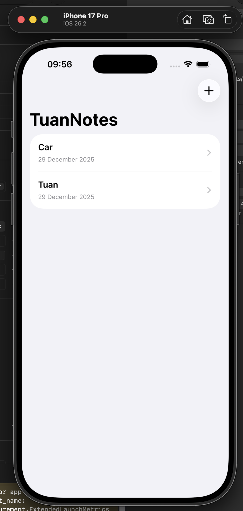
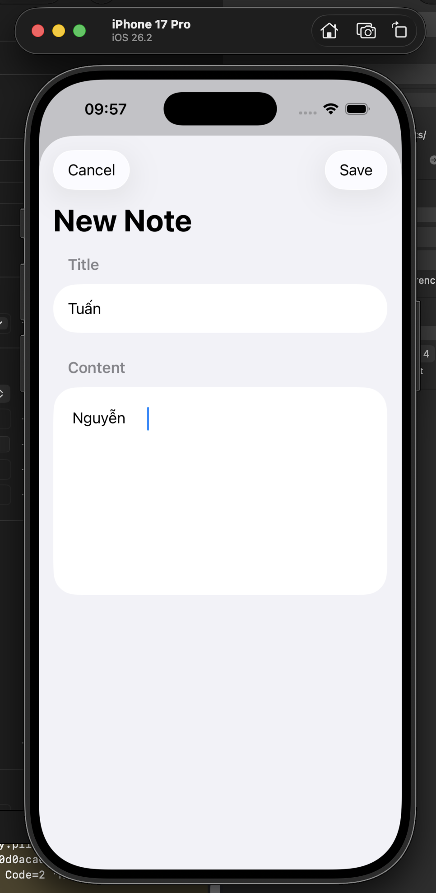
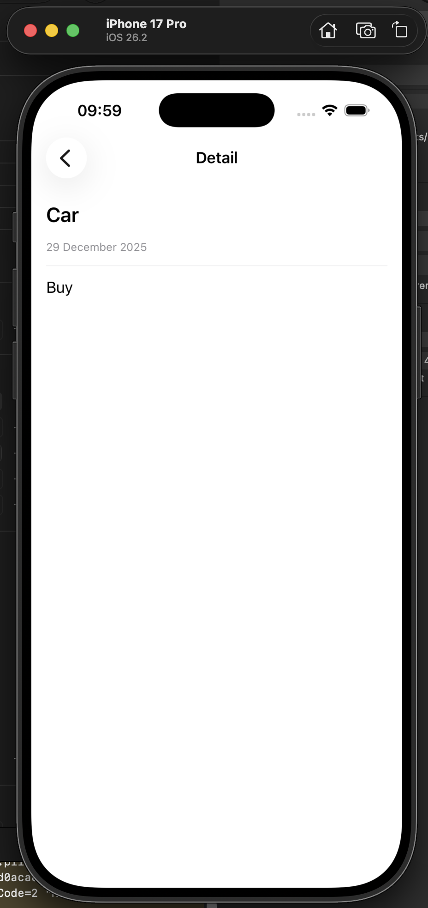

# TuanNotes (SwiftUI Practice App)
A simple Notes app built with SwiftUI for practicing:
- NavigationStack
- List + CRUD
- @State / ObservableObject
- UserDefaults for local storage

## Features
- Add note
- View note detail
- Delete note
- Persist data locally

## Tech Stack
Swift, SwiftUI, Xcode

## Author
Nguyen Dang Quoc Tuan
## Screenshots

  
  
  

